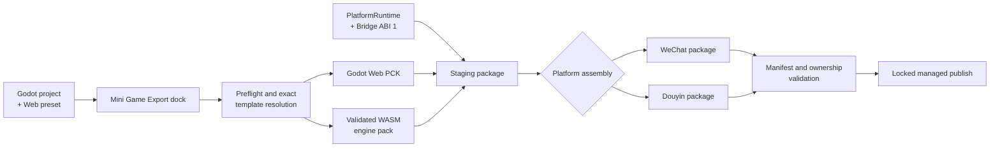

<p align="center">
  
</p>

<p align="center">
  <strong>Export Godot games to WeChat and Douyin Mini Games directly from the editor.</strong><br />
  CI-validated WASM engine, transactional export pipeline, and one versioned GDScript SDK.
</p>

<p align="center">
  <a href="https://github.com/AnranS/godot_for_minigame/releases/latest"></a>
  <a href="https://github.com/AnranS/godot_for_minigame/actions/workflows/smoke-test-export.yml"></a>
  
  <a href="LICENSE"></a>
</p>

<p align="center">
  <a href="https://anrans.github.io/godot_for_minigame/">Official website</a> ·
  <a href="https://github.com/AnranS/godot_for_minigame/releases/latest">Download latest</a> ·
  <a href="#quick-start">Quick start</a> ·
  <a href="https://anrans.github.io/godot_for_minigame/api/">API reference</a>
</p>

<p align="center">
  <strong>English</strong> · <a href="README_zh.md">简体中文</a>
</p>

---

Godot Mini Game turns a normal Godot project into a platform-ready WeChat or
Douyin Mini Game package. Day-to-day export does not require Node.js, Brotli,
Emscripten, or a separate Godot Web template download.

## Why Godot Mini Game?

- **Editor-native export** — build the PCK, assemble platform files, and publish the output from one dock.
- **CI-validated engine pack** — the bundled engine has an exact Godot source identity and a mini-game-compatible WASM feature profile.
- **One SDK, two platforms** — `MiniGameSDK` exposes 220 methods and 82 signals for storage, auth, ads, media, networking, platform UI, and more.
- **Safe output ownership** — staging, hashes, manifests, and a publish lock replace only exporter-managed paths while preserving top-level sidecars.
- **Repeatable versioning** — Godot, Emscripten, build profile, revision, schemas, and Bridge ABI are selected as one template tuple.

## Compatibility at a glance

| Contract | Bundled value |
|---|---|
| Plugin release | `v0.2.1` |
| Godot | `4.6.1.stable` · commit `14d19694e0c8` |
| Emscripten | `4.0.3` |
| Build | `2d_full` · `release` · revision `1` |
| Runtime contract | Bridge ABI `1` · template schema `1` · output schema `1` |

| Target | Runtime provider | Automated validation |
|---|---|---|
| WeChat Mini Game | `wx` | Full export, manifest, WASM, and package checks |
| Douyin Mini Game | `tt` | Full export, manifest, WASM, and package checks |

> [!IMPORTANT]
> The bundled engine is validated by this project for the exact identity above. Another Godot
> editor build requires a matching template pack. Automated validation does not
> replace final testing in the platform DevTools and on target devices.

[`support-matrix.json`](support-matrix.json) is the source of truth for supported
template identities and platform status.

## How it works



The selected engine identity, hashes, managed files, and output manifest are
verified first. Under the output lock, exporter-owned top-level paths are then
published from staging while other top-level sidecars remain in place. See
[Architecture and versioning](docs/ARCHITECTURE.md) for the rollback and crash
recovery boundaries.

## Quick start

### 1. Install the release asset

Open the [latest release](https://github.com/AnranS/godot_for_minigame/releases/latest),
download `godot_mini_game_vX.Y.Z.zip` from **Assets**, and extract it into the
root of your Godot project. Do not use GitHub's auto-generated source archive.

```text
your_project/
└── addons/
    └── godot_mini_game/
```

<details>
<summary>Install from source for development</summary>

```bash
git clone https://github.com/AnranS/godot_for_minigame.git
mkdir -p your_project/addons
cp -R godot_for_minigame/addons/godot_mini_game your_project/addons/godot_mini_game
```

</details>

### 2. Enable the plugin

In Godot, open **Project > Project Settings > Plugins** and enable
**Godot Mini Game Export**.

### 3. Add a Web preset

Open **Project > Export** and add a **Web** preset. Its name is up to you; the
standard Web export templates do not need to be downloaded.

### 4. Export

Open the **Mini Game Export** dock, then:

1. Select WeChat or Douyin.
2. Enter the App ID and choose an orientation.
3. Select the Web preset and a dedicated output directory.
4. Click **Export**, then open the result in the matching platform DevTools.

## SDK in 60 seconds

`MiniGameSDK` is registered as an autoload. Async calls return through signals;
methods remain safe to call while developing outside a mini-game runtime.

```gdscript
MiniGameSDK.login_completed.connect(func(code: String, error: String) -> void:
    if error.is_empty():
        print("login code: ", code)
)
MiniGameSDK.login()

MiniGameSDK.storage_set("level", "5")
var level := MiniGameSDK.storage_get("level", "1")
MiniGameSDK.show_toast("Level %s" % level, "success")
```

At startup the SDK negotiates Bridge ABI 1. Inspect `is_mini_game`, `bridge_info`,
and `bridge_initialization_error` when diagnosing integration issues.

**[Browse all 220 methods and 82 signals →](https://anrans.github.io/godot_for_minigame/api/)**

## Documentation

| I want to… | Read |
|---|---|
| Install, configure, and export a game | [Usage guide](docs/USAGE.md) |
| Find an SDK method or signal | [Searchable API reference](https://anrans.github.io/godot_for_minigame/api/) |
| Understand the export transaction | [Architecture and versioning](docs/ARCHITECTURE.md) |
| Build or import another engine pack | [Custom template guide](docs/USAGE.md) |
| Publish a new plugin version | [Release process](docs/RELEASING.md) |
| Report a problem or request a feature | [GitHub Issues](https://github.com/AnranS/godot_for_minigame/issues) |

Chinese documentation: [使用指南](docs/USAGE_zh.md) · [中文首页](README_zh.md)

## Contributing

Issues and pull requests are welcome. Please keep platform-specific behavior
behind the shared runtime/bridge contracts and run the export test suite before
submitting a change. Maintainers should follow the immutable
[release process](docs/RELEASING.md).

## License

The plugin is available under the [MIT License](LICENSE). The bundled Godot
engine retains its upstream notices; see
[`GODOT_COPYRIGHT.txt`](addons/godot_mini_game/GODOT_COPYRIGHT.txt) and
[`THIRD_PARTY_NOTICES.md`](addons/godot_mini_game/THIRD_PARTY_NOTICES.md).
