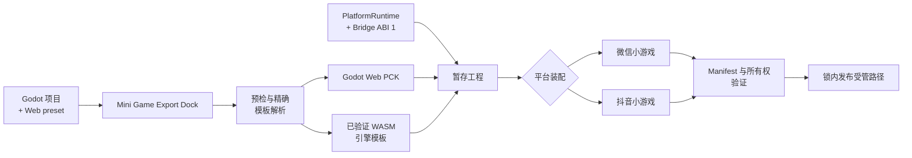

<p align="center">
  
</p>

<p align="center">
  <strong>直接从 Godot 编辑器导出微信与抖音小游戏。</strong><br />
  经项目 CI 验证的 WASM 引擎、事务式导出流水线，以及一套带版本契约的 GDScript SDK。
</p>

<p align="center">
  <a href="https://github.com/AnranS/godot_for_minigame/releases/latest"></a>
  <a href="https://github.com/AnranS/godot_for_minigame/actions/workflows/smoke-test-export.yml"></a>
  
  <a href="LICENSE"></a>
</p>

<p align="center">
  <a href="https://anrans.github.io/godot_for_minigame/">官方网站</a> ·
  <a href="https://github.com/AnranS/godot_for_minigame/releases/latest">下载最新版</a> ·
  <a href="#快速开始">快速开始</a> ·
  <a href="https://anrans.github.io/godot_for_minigame/api/">API 文档</a>
</p>

<p align="center">
  <a href="README.md">English</a> · <strong>简体中文</strong>
</p>

---

Godot Mini Game 可以把普通 Godot 项目转换成微信或抖音小游戏工程。日常导出
不需要安装 Node.js、Brotli、Emscripten，也不需要另外下载 Godot Web 导出模板。

## 为什么选择 Godot Mini Game？

- **编辑器内完成导出**——在一个 Dock 中生成 PCK、装配平台文件并发布结果。
- **经 CI 验证的引擎模板**——内置引擎包含精确的 Godot 源码身份和小游戏兼容的 WASM 特性配置。
- **一套 SDK，两个平台**——`MiniGameSDK` 提供 220 个方法、82 个信号，覆盖存储、登录、广告、媒体、网络和原生 UI 等能力。
- **安全管理输出目录**——暂存、哈希、Manifest 和发布锁只替换导出器受管路径，并保留顶层旁路文件。
- **可重复的多版本管理**——Godot、Emscripten、构建配置、revision、schema 与 Bridge ABI 组成完整模板身份。

## 兼容性概览

| 契约 | 内置值 |
|---|---|
| 插件版本 | `v0.2.1` |
| Godot | `4.6.1.stable` · commit `14d19694e0c8` |
| Emscripten | `4.0.3` |
| 构建 | `2d_full` · `release` · revision `1` |
| 运行时契约 | Bridge ABI `1` · template schema `1` · output schema `1` |

| 目标平台 | 运行时 Provider | 自动化验证 |
|---|---|---|
| 微信小游戏 | `wx` | 完整导出、Manifest、WASM 与包结构检查 |
| 抖音小游戏 | `tt` | 完整导出、Manifest、WASM 与包结构检查 |

> [!IMPORTANT]
> 内置引擎只经过本项目对上述精确身份的验证。其它 Godot 编辑器构建必须导入完全匹配的
> 模板包。自动化验证不能替代平台开发者工具和目标真机上的最终验收。

[`support-matrix.json`](support-matrix.json) 是模板身份与平台状态的唯一事实源。

## 工作原理



导出器会先验证所选引擎身份、文件哈希、受管文件和输出 Manifest，再在输出锁内
从暂存区发布受管顶层路径；其它顶层旁路文件保持不变。回滚和异常中断边界详见
[架构与版本管理](docs/ARCHITECTURE.md)。

## 快速开始

### 1. 安装 Release 资产

打开[最新版本](https://github.com/AnranS/godot_for_minigame/releases/latest)，
从 **Assets** 下载 `godot_mini_game_vX.Y.Z.zip`，然后解压到 Godot 项目根目录。
不要下载 GitHub 自动生成的 Source code 压缩包。

```text
your_project/
└── addons/
    └── godot_mini_game/
```

<details>
<summary>从源码安装，用于开发调试</summary>

```bash
git clone https://github.com/AnranS/godot_for_minigame.git
mkdir -p your_project/addons
cp -R godot_for_minigame/addons/godot_mini_game your_project/addons/godot_mini_game
```

</details>

### 2. 启用插件

在 Godot 中打开 **项目 > 项目设置 > 插件**，启用
**Godot Mini Game Export**。

### 3. 添加 Web 导出预设

打开 **项目 > 导出** 并添加一个 **Web** preset，名称可以自定，不需要下载
标准 Web 导出模板。

### 4. 导出

打开底部的 **Mini Game Export** Dock，然后：

1. 选择微信或抖音。
2. 输入 App ID 并选择屏幕方向。
3. 选择 Web preset 和一个专用输出目录。
4. 点击 **Export**，再用对应的平台开发者工具打开导出结果。

## 60 秒上手 SDK

插件会将 `MiniGameSDK` 注册成 Autoload。异步接口通过信号返回；在非小游戏
环境中开发时，也可以安全调用这些方法。

```gdscript
MiniGameSDK.login_completed.connect(func(code: String, error: String) -> void:
    if error.is_empty():
        print("login code: ", code)
)
MiniGameSDK.login()

MiniGameSDK.storage_set("level", "5")
var level := MiniGameSDK.storage_get("level", "1")
MiniGameSDK.show_toast("Level %s" % level, "success")
```

启动时 SDK 会协商 Bridge ABI 1。排查集成问题时可检查 `is_mini_game`、
`bridge_info` 和 `bridge_initialization_error`。

**[查看全部 220 个方法和 82 个信号 →](https://anrans.github.io/godot_for_minigame/api/)**

## 文档导航

| 我想要…… | 文档 |
|---|---|
| 安装、配置并导出游戏 | [中文使用指南](docs/USAGE_zh.md) |
| 查找 SDK 方法或信号 | [可搜索 API 文档](https://anrans.github.io/godot_for_minigame/api/) |
| 理解导出事务 | [架构与版本管理](docs/ARCHITECTURE.md) |
| 构建或导入其它引擎模板 | [自定义模板指南](docs/USAGE_zh.md) |
| 发布新的插件版本 | [发布流程](docs/RELEASING.md) |
| 报告问题或提出功能建议 | [GitHub Issues](https://github.com/AnranS/godot_for_minigame/issues) |

英文文档：[Usage guide](docs/USAGE.md) · [English README](README.md)

## 参与贡献

欢迎提交 Issue 和 Pull Request。平台差异应保持在共享 Runtime/Bridge 契约之后，
提交变更前请运行完整导出测试。维护者请遵循不可变 Tag 的
[发布流程](docs/RELEASING.md)。

## 许可证

插件采用 [MIT License](LICENSE)。内置 Godot 引擎保留上游版权声明，详见
[`GODOT_COPYRIGHT.txt`](addons/godot_mini_game/GODOT_COPYRIGHT.txt) 和
[`THIRD_PARTY_NOTICES.md`](addons/godot_mini_game/THIRD_PARTY_NOTICES.md)。
