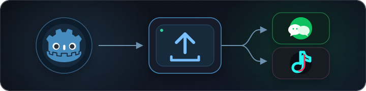

<p align="center">
  
</p>

<p align="center">
  <a href="README.md">English</a> · <strong>简体中文</strong>
</p>

---

一个 Godot 4.x 编辑器插件，把你的游戏一键打包成可直接提审的**微信小游戏**或**抖音小游戏**。内置预编译引擎模板——装好插件、点导出、用开发者工具打开即可。

## 特性

- **零配置**——自带引擎模板，不需要自己折腾 Emscripten
- **一键导出**——编辑器底部 Dock 面板搞定一切：`.pck`、引擎文件、JS 适配、平台配置
- **真机可跑**——引擎去掉了 `WXWebAssembly` 不支持的 WASM SIMD / 异常处理 Tag
- **13 类原生 API**——登录、广告、支付、存储、分享、振动、键盘、剪贴板、网络等
- **双平台**——一套项目同时出微信、抖音

## 快速开始

### 1. 安装

下载 [最新 release](../../releases) 解压到项目根目录：

```
your_project/
  addons/
    godot_mini_game/   ← 解压到这里
```

或者克隆本仓库后把 `addons/godot_mini_game/` 复制过去。

### 2. 启用插件

**Project > Project Settings > Plugins** 里启用 **Godot Mini Game Export**。

### 3. 添加一个 Web 导出预设

**Project > Export** 里添加一个 **Web** 预设（名字随便），不需要下载官方的 Web 导出模板。

### 4. 导出

打开编辑器底部的 **Mini Game Export** Dock：

1. 选平台（WeChat / Douyin）
2. 填 App ID，选屏幕方向
3. 选刚才那个 Web 预设和输出目录
4. 点 **Export**

导出目录直接用**微信开发者工具**或**抖音开发者工具**打开即可。

## SDK API

插件会把 `MiniGameSDK` 注册为 autoload，所有异步结果都通过信号回来。在非小游戏环境（比如编辑器里）所有方法都是安全的空实现，可以照常开发调试。

```gdscript
# 登录
MiniGameSDK.login_completed.connect(func(code, err):
    if err.is_empty(): print("code: ", code)
)
MiniGameSDK.login()

# 存储（同步接口）
MiniGameSDK.storage_set("level", "5")
var level = MiniGameSDK.storage_get("level", "1")

# 激励视频广告
MiniGameSDK.ad_created.connect(func(type, ok, err):
    if ok: MiniGameSDK.show_rewarded_ad()
)
MiniGameSDK.rewarded_ad_result.connect(func(completed, err):
    if completed: give_reward()
)
MiniGameSDK.create_rewarded_ad("your-ad-unit-id")

# 轻提示 / 震动
MiniGameSDK.show_toast("Hello!", "success")
MiniGameSDK.vibrate_short("medium")
```

<details>
<summary><strong>完整 API 参考</strong></summary>

### 信号

| 信号 | 参数 |
|------|------|
| `login_completed` | `code: String, error: String` |
| `session_checked` | `valid: bool, error: String` |
| `user_info_received` | `info_json: String, error: String` |
| `ad_created` | `ad_type: String, success: bool, error: String` |
| `rewarded_ad_result` | `is_ended: bool, error: String` |
| `interstitial_ad_result` | `success: bool, error: String` |
| `payment_result` | `success: bool, error: String` |
| `keyboard_event` | `event_type: String, value: String` |
| `http_response` | `status_code: int, data: String, error: String` |
| `clipboard_received` | `data: String, error: String` |
| `modal_result` | `confirmed: bool` |
| `app_shown` | `options_json: String` |
| `app_hidden` | — |
| `app_error` | `message: String` |

### 方法

| 分类 | 方法 |
|------|------|
| **登录鉴权** | `login()` `check_session()` `get_user_info()` |
| **本地存储** | `storage_set(key, val)` `storage_get(key, default)` `storage_remove(key)` `storage_clear()` `storage_info()` |
| **分享** | `share_app(title, image_url, query)` `show_share_menu()` `hide_share_menu()` |
| **激励广告** | `create_rewarded_ad(id)` `show_rewarded_ad()` |
| **Banner 广告** | `create_banner_ad(id)` `show_banner_ad()` `hide_banner_ad()` `destroy_banner_ad()` |
| **插屏广告** | `create_interstitial_ad(id)` `show_interstitial_ad()` |
| **支付** | `request_payment(params)` |
| **振动** | `vibrate_short(type)` `vibrate_long()` |
| **键盘** | `show_keyboard(default_value, max_length, multiple)` `hide_keyboard()` |
| **剪贴板** | `set_clipboard(data)` `get_clipboard()` |
| **网络请求** | `http_request(url, method, data, headers)` |
| **系统信息** | `get_system_info()` `get_launch_options()` `get_window_info()` `get_menu_button_rect()` |
| **UI 交互** | `show_toast(title, icon, duration)` `show_modal(title, content)` `show_loading(title)` `hide_loading()` |
| **屏幕** | `set_keep_screen_on(keep_on)` |

</details>

## 引擎模板

插件在 `addons/godot_mini_game/engine/` 内置了一份预编译引擎（Godot 4.6.1，Brotli 压缩后约 6 MB）。

**为什么要自定义模板？** 官方 Godot Web 导出默认启用了 SIMD、异常处理 Tag 等 WASM 特性，真机上的 `WXWebAssembly` 不支持，加载会直接 CompileError 挂掉。内置模板改用下面的参数重新编译：

- `wasm_simd=no`
- `SUPPORT_LONGJMP='emscripten'`（避免生成 WASM Tag section）
- `threads=no`

### 模板查找顺序

| 优先级 | 来源 | 说明 |
|--------|------|------|
| 1 | `addons/godot_mini_game/godot.js` + `godot.wasm.br` | 手动覆盖（最高） |
| 2 | `addons/godot_mini_game/engine/` | 插件内置（默认） |
| 3 | `~/.config/godot_mini_game/templates/{version}/` | 通过 Dock 导入 |
| 4 | Godot 官方 Web 导出模板 | 仅开发者工具模拟器可用，会给出警告 |

### 为其它 Godot 版本编译模板

```bash
# 本地构建（Apple Silicon 约 5 分钟）
./scripts/build_wasm_template.sh 4.x.x-stable

# 然后在 Dock 里点「Import Engine Template」导入生成的 zip
```

也可以跑 GitHub Actions 工作流：**Actions > Build Mini-Game WASM Template**。

## 目录结构

```
addons/godot_mini_game/
├── plugin.cfg / plugin.gd          # 编辑器插件入口
├── export_dock.gd / .tscn          # 导出 UI Dock
├── exporter.gd                     # 导出流水线
├── MiniGameSDK.gd                  # GDScript SDK autoload
├── engine/                          # 内置引擎（godot.js + godot.wasm.br）
└── templates/
    ├── common/
    │   ├── adapter.js               # DOM/BOM/Canvas/Audio/Input 适配层
    │   ├── fetch.js                 # Fetch API polyfill
    │   ├── js/libs/sdk.js           # JS ↔ GDScript 桥
    │   ├── js/loader.js             # 引擎加载器 + 加载动画
    │   └── js/worker/               # 微信 game.json 需要的 worker 脚本
    ├── wechat/                      # 微信平台配置
    └── douyin/                      # 抖音平台配置
```

## 依赖

- **Godot 4.6.x** — 内置引擎模板基于 4.6.1-stable 编译。其它 4.x 版本几乎一定会在运行时挂掉，
  因为 `.pck` 字节码和内置 WASM 必须来自同一个 Godot 版本。要用别的版本必须
  自己重编一份匹配的模板（见"为其它 Godot 版本编译模板"），然后通过 Dock 导入。
- **微信开发者工具** 或 **抖音开发者工具**
- **Node.js** *必需*（用于内置 Brotli 压缩）或 `brotli` CLI（`brew install brotli`）。
  两者都没有时导出会失败 —— 未压缩的 WASM 超过微信单包 4 MB 上限。

## 文档

- [使用文档（中文）](docs/USAGE_zh.md)——Dock 面板、SDK、分包、排错、自建引擎模板的完整说明
- [Usage guide (English)](docs/USAGE.md)

## 参与贡献

欢迎提 Issue 和 PR。自己编译引擎模板参考 `scripts/build_wasm_template.sh`。

## 许可证

[MIT](LICENSE)
